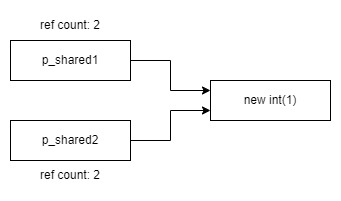
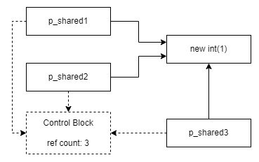
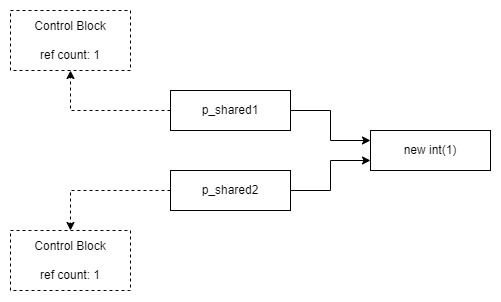
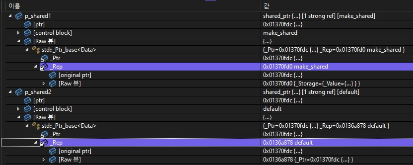
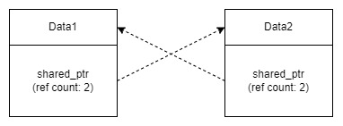

> 본 글은  `shared_ptr`에 대한 설명입니다.
>
> `shared_ptr`클래스가 갖는 멤버 변수나 함수에 대한 자세한 설명은 다른 글에 작성하겠습니다.

# 설명

## `shared_ptr`이란?

`shared_ptr`은 `unique_ptr`과 달리 자원 객체에 대한 소유권을 공유하는 스마트 포인터입니다. `shared_ptr`을 사용하기 위해선 `memory` 헤더를 포함해야 합니다.

`shared_ptr`은 사용이 끝나 스코프에서 벗어나게 되면 자원 객체를 `delete`하지 않고 소유권만 박탈됩니다. 자원 객체를 공유하기 때문에 `unique_ptr`과 달리 복사 생성자를 사용할 수 있습니다.

여러 포인터 객체가 하나의 자원 객체에 접근하기 때문에 후에 자원 객체를 해제하기 위해서는 이 자원 객체를 사용하는 모든 포인터 객체들이 소멸되어야 하는데, 어떤 포인터 객체가 먼저 소멸되는지 알 수 없어 어느 시점에 자원 객체를 해제 시켜야 하는지 알 수 없습니다.

이를 위해 `shared_ptr`은 자원 객체를 참조하는 포인터 객체를 추적해, 그 수가 0이 되었을 때 자원 객체를 해제시킵니다.


## `shared_ptr` 사용하기

`shared_ptr`은 `unique_ptr`처럼 생성자나 `make_shared` 함수를 이용해 생성할 수 있습니다. 다만 위에서 언급했듯이 복사 생성자를 허용하기 때문에 포인터 객체를 넘기거나 대입 연사자를 이용할 수 있습니다.

```cpp
std::shared_ptr<int> p_shared1(new int(1));
std::shared_ptr<int> p_shared2(p_shared1);	// p_shared1을 가리키는 포인터 객체 생성

std::unique_ptr<int> p_unique1(new int(2));
std::unique_ptr<int> p_unique2(p_unique1);	// 컴파일 오류 발생
```

> `unique_ptr`은 유일한 소유권만을 갖기 때문에 컴파일 오류가 발생하는 것을 볼 수 있습니다.



 `shared_ptr`은 같은 자원 객체를 가리킬 수 있으며 같은 자원 객체를 가리키고 있는 포인터 객체의 수를 참조 개수(reference count)라고 합니다. 이 참조 개수가 0이 되었을 때, 자동으로 자원 객체를 해제합니다. 위 그림의 경우 `p_shared1 `과 `p_shared2`가 같은 자원 객체를 가리키고 있으므로 참조 개수는 2가 됩니다.

```cpp
#include <iostream>
#include <memory>

using namespace std;

int main()
{
	shared_ptr<int> p_shared1(new int(1));
	shared_ptr<int> p_shaerd2(p_shaerd1);

	cout << "p_shared1 참조 개수: " << p_shaerd1.use_count() << endl;
	cout << "p_shared2 참조 개수: " << p_shaerd2.use_count() << endl;
}
```
```
[출력 결과]
p_shared1 참조 개수: 2
p_shared2 참조 개수: 2
```

> `shared_ptr`의 현재 참조 개수를 알고 싶다면 `use_count` 멤버 함수를 호출하면 알 수 있습니다.

다음 예제를 통해 참조 개수가 0이 되었을 때, 제대로 자원을 해제하는지 확인해보겠습니다.

```cpp
#include <iostream>
#include <memory>
#include <vector>

using namespace std;

class Data
{
public:
	Data()
	{
		cout << "생성자 호출" << endl;
	}

	~Data()
	{
		cout << "소멸자 호출" << endl;
	}
};

int main()
{
	vector<shared_ptr<Data>> vec;

	vec.push_back(shared_ptr<Data>(new Data()));
	vec.push_back(vec[0]);
	vec.push_back(vec[1]);

	cout << "첫 번째 원소 삭제" << endl;
	vec.erase(vec.begin());

	cout << "두 번째 원소 삭제" << endl;
	vec.erase(vec.begin());

	cout << "세 번째 원소 삭제" << endl;
	vec.erase(vec.begin());
}
```
```
[출력 결과]
생성자 호출
첫 번째 원소 삭제
두 번째 원소 삭제
세 번째 원소 삭제
소멸자 호출
```

벡터에 `shared_ptr` 객체를 원소로 저장하는 벡터를 정의한 후, `vec[0]`, `vec[1]`, `vec[2]` 위치에 모두 같은 자원 객체를 가리키는 서로 다른 포인터 객체를 넣었습니다.

벡터의 `erase` 멤버함수를 호출해 첫 번째 원소를 삭제 했지만 `shared_ptr`은 참조 개수가 0이 되었을 때만 자원 객체를 해제하기 때문에 소멸자가 호출되지 않습니다. 마지막 원소인 세 번째 원소를 삭제 했을 때, 소멸자가 호출되는 것을 확인할 수 있습니다.

지금까지 `shared_ptr`의 중요한 특성인 참조 개수에 대해 알아봤습니다. 그렇다면 여기서 한 가지 의문점이 생깁니다. `shared_ptr`은 어떻게 같은 자원 객체를 가리키는 포인터 객체의 참조 개수를 동기화하는 것일까요?

`shared_ptr`은 참조 개수를 파악하기 위해 처음으로 포인터 객체를 생성할 때, **제어 블록(Control Block)**을 동적 할당합니다. 이후 같은 자원 객체를 가리키는 포인터 객체들은 이 제어 블록을 공유하면서 참조 개수를 동기화 하는 것입니다.



### `make_shared`로 생성하기

위에선 `shared_ptr`을 생성자로 초기화했지만 사실 권장되는 방법이 아닙니다. 왜냐하면 인자로 전달되는 자원 객체를 위한 동적 할당, 제어 블록을 위한 동적 할당을 해야하기 때문입니다.

동적 할당을 상당히 비싼 연산입니다. 때문에 줄일 수 있다면 최대한 줄이는 것이 좋습니다. 즉, **처음부터 자원 객체와 제어 블록를 합친 메모리를 한 번 할당하는 것이 훨씬 빠릅니다.**

## `make_shared` 주의점

### 포인터(주소값)로 초기화 지양하기

`shared_ptr`은 인자로 주소값이 전달된다면 첫 번째 객체를 생성하는 것으로 판단합니다. 즉, 같은 자원 객체를 가르키고 있더라도 다른 제어 블록을 갖게 되는 것입니다.



두 포인터 객체는 같은 자원 객체를 가리키지만 서로 다른 제어 블록을 갖기 때문에 서로의 존재를 인지하지 못해 참조 개수를 1로 설정하게 됩니다. 이렇게 된다면 둘 중 먼저 스코프를 벗어나 참조 개수가 0이 되면서 다른 포인터 객체가 아직 자원 객체를 가리키고 있지만 자원 객체를 해제하게 됩니다.

만약 운이 좋게 다른 포인터 객체가 이후에 사용되지 않아 오류가 발생하지 않았어도 포인터 객체가 소멸되어 참조 개수가 0이되면 이미 해제했던 자원 객체를 다시 소멸시키기 때문에 오류가 발생하게 됩니다.

```cpp
#include <iostream>
#include <memory>

using namespace std;

class Data
{
public:
	Data()
	{
		cout << "생성자 호출" << endl;
	}

	~Data()
	{
		cout << "소멸자 호출" << endl;
	}
};

int main()
{
	auto ptr = new Data();

	shared_ptr<Data> p_shared1(ptr);
	shared_ptr<Data> p_shared2(ptr);

	cout << "p_shared1 참조 개수: " << p_shared1.use_count() << endl;
	cout << "p_shared2 참조 개수: " << p_shared2.use_count() << endl;
}
```

```
[출력 결과]
생성자 호출
p_shared1 참조 개수: 1
p_shared2 참조 개수: 1
소멸자 호출
소멸자 호출
<런타임 오류 발생>
```

이와 같은 상황을 피하기 위해 주소값(포인터)로 초기화 되는 것을 지양해야 합니다.

### `enable_shared_from_this`

하지만, 객체 내부에서 자기 자신을 가리키는 `shared_ptr`을 만들어야 하는 등의 어쩔 수 없는 상황이 발생하기도 합니다.

```cpp
#include <iostream>
#include <memory>

using namespace std;

class Data
{
public:
	Data()
	{
		cout << "생성자 호출" << endl;
	}

	~Data()
	{
		cout << "소멸자 호출" << endl;
	}

	shared_ptr<Data> get_self() { return shared_ptr<Data>(this); }
};

int main()
{
	shared_ptr<Data> p_shared1 = make_shared<Data>();
	shared_ptr<Data> p_shared2 = p_shared1->get_self();

	cout << "p_shared1 참조 개수: " << p_shared1.use_count() << endl;
	cout << "p_shared2 참조 개수: " << p_shared2.use_count() << endl;
}
```

```
[출력 결과]
생성자 호출
p_shared1 참조 개수: 1
p_shared2 참조 개수: 1
소멸자 호출
<런타임 오류 발생>
```



`get_self` 멤버 함수에서 생성되는 포인터 객체에 전달한 `this`은 포인터 즉, 주소값입니다. 때문에 위의 예제처럼 `p_shared1`과 `p_shared2`는 서로의 존재를 알지 못한채 다른 제어 블록을 생성하게 되었고 오류를 발생시키게 되었습니다.

이 문제는 `enable_shared_from_this`를 상속받는 것으로 간단하게 해결할 수 있습니다.

```cpp
#include <iostream>
#include <memory>

using namespace std;

class Data : public enable_shared_from_this<Data>
{
public:
	Data()
	{
		cout << "생성자 호출" << endl;
	}

	~Data()
	{
		cout << "소멸자 호출" << endl;
	}

	shared_ptr<Data> get_self() { return shared_from_this(); }
};

int main()
{
	shared_ptr<Data> p_shared1 = make_shared<Data>();
	shared_ptr<Data> p_shared2 = p_shared1->get_self();

	cout << "p_shared1 참조 개수: " << p_shared1.use_count() << endl;
	cout << "p_shared2 참조 개수: " << p_shared2.use_count() << endl;
}
```

```
[출력 결과]
생성자 호출
p_shared1 참조 개수: 2
p_shared2 참조 개수: 2
소멸자 호출
```

`enable_shared_from_this<Data>`를 상속 받고 자기 자신 포인터 객체를 반환할 때, 새롭게 생성하는 대신 상속받은 `shared_from_this` 멤버 함수를 호출해 반환하면 정상적으로 참조 개수가 갱신되면서 오류가 발생하지 않는 것을 확인할 수 있습니다.
한 가지 중요한 점은 `shared_from_this` 멤버 함수가 제대로 작동하기 위해선 해당 객체를 가리키고 있는 포인터 객체를 반드시 먼저 정의해야 한다는 것입니다. 왜냐하면 `shared_from_this` 멤버 함수는 해당 객체를 가리키고 있는 제어 블록을 확인할 뿐, 제어 블록을 생성하지 않기 때문입니다.

```
#include <iostream>
#include <memory>

using namespace std;

class Data : public enable_shared_from_this<Data>
{
public:
	Data()
	{
		cout << "생성자 호출" << endl;
	}

	~Data()
	{
		cout << "소멸자 호출" << endl;
	}

	shared_ptr<Data> get_self() { return shared_from_this(); }
};

int main()
{
	Data* p_data = new Data();
	shared_ptr<Data> p_shared = p_data->get_self();
}

```

```
[출력 결과]
생성자 호출
<런타임 오류 발생>
```

### 순환참조 - 서로 참조하는 `shared_ptr`

`shared_ptr`은 참조 개수가 0이 되어야 자원을 해제할 수 있습니다. 하지만 객체를 더 이상 사용하지 않음에도 불구하고 참조 개수가 0으로 떨어지지 않는 상황이 존재합니다.



`shared_ptr` 포인터 객체로 할당된 Data1, Data2가 존재하고 있을 때, Data 멤버 변수의 `shared_ptr` 포인터 객체가 서로를 가리키고 있습니다. 이 같은 형태를 **순환 참조**라고 합니다.

Data1이 파괴되기 위해서는 참조 개수가 0이 되어야 합니다. 그러기 위해선 Data2의 멤버 변수인 포인터 객체가 소멸되어야 합니다. 즉, Data2가 소멸되어야 합니다. 하지만 Data2가 소멸되기 위해선 Data1이 파괴어야 합니다.

즉, 이러지도 저러지도 못하는 상황이 된 것입니다.

```cpp
#include <iostream>
#include <memory>

using namespace std;

class Data : public enable_shared_from_this<Data>
{
private:
	shared_ptr<Data> other;

public:
	Data()
	{
		cout << "생성자 호출" << endl;
	}

	~Data()
	{
		cout << "소멸자 호출" << endl;
	}

	void set_other(shared_ptr<Data>& other) { this->other = other; }
};

int main()
{
	shared_ptr<Data> p_shared1 = make_shared<Data>();
	shared_ptr<Data> p_shared2 = make_shared<Data>();

	p_shared1->set_other(p_shared2);
	p_shared2->set_other(p_shared1);
}
```
```
[출력 결과]
생성자 호출
생성자 호출
```

출력 결과를 보면 서로 파괴할 수 없는 상태가 되어 소멸자가 호출되지 않는 것을 확인할 수 있습니다.

이 문제는 `shared_ptr`의 설계 한계에 의한 문제이기 때문에 `shared_ptr`을 통해서 이 문제를 해결할 수는 없습니다. 하지만 이 문제를 해결하기 위해 `weak_ptr`입니다.

다음에는 `weak_ptr`에 대해 알아보겠습니다.

# 참고

[cppreference - en](https://en.cppreference.com/w/cpp/memory/shared_ptr)

[cppreference - ko](https://ko.cppreference.com/w/cpp/memory/shared_ptr)

[VisualC++ Docs](https://learn.microsoft.com/ko-kr/cpp/cpp/how-to-create-and-use-shared-ptr-instances?view=msvc-170)

[TCP School](https://www.tcpschool.com/cpp/cpp_template_smartPointer)

[모두의 코드](https://modoocode.com/252)

[식빵맘(ansohxxn)](https://ansohxxn.github.io/cpp/chapter15-6/)
