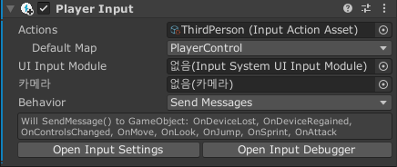
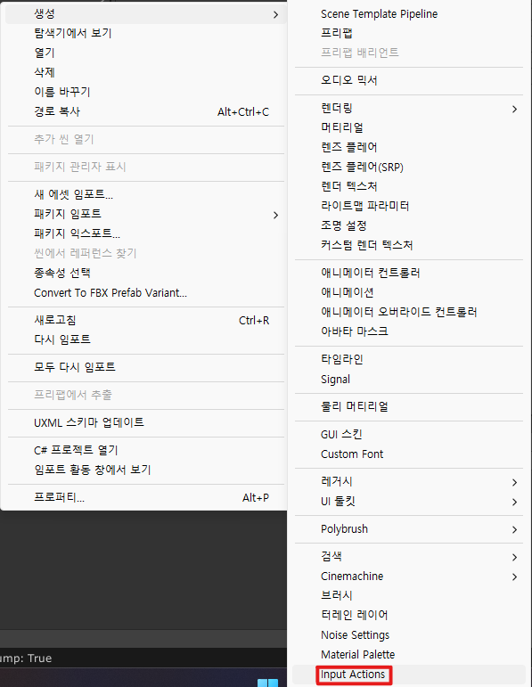
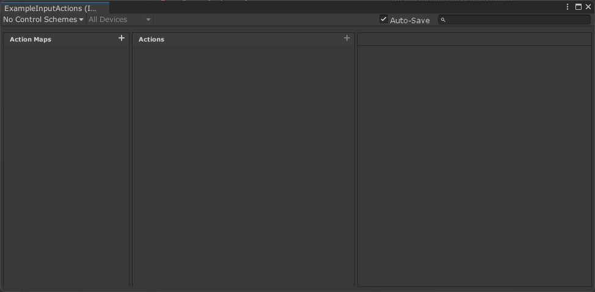
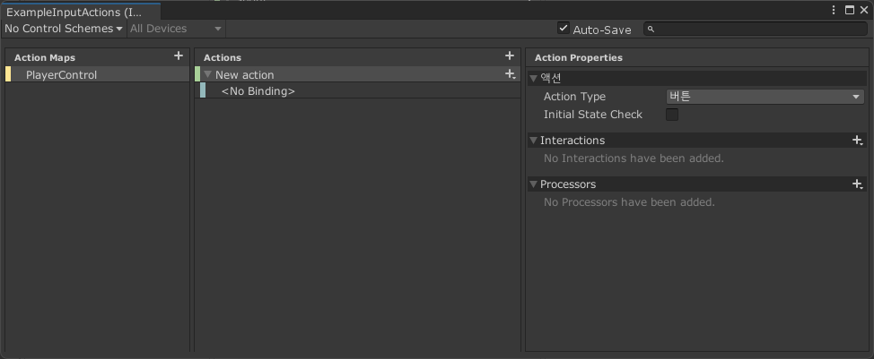
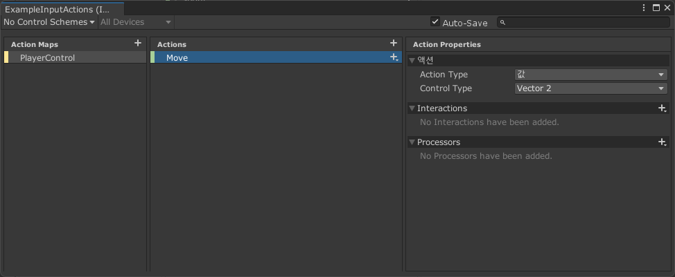
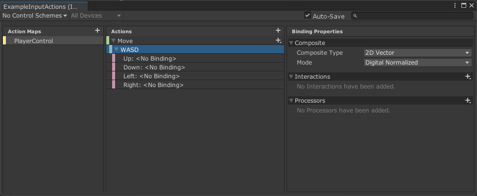
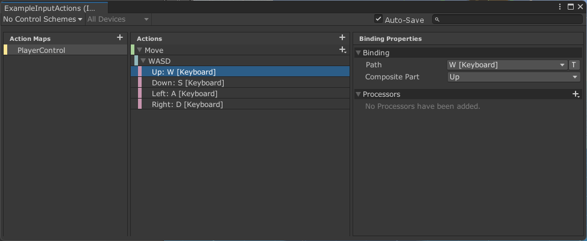
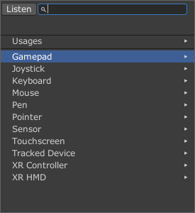

# 설명
New Input System은 다양한 기기와 플랫폼 전반에 걸친 사용 편의성과 일관성을 초점으로 개발된 새로운 입력 시스템으로 기존의 입력 시스템의 불편한 점이 개선됐습니다.

기존의 입력 시스템은 지금처럼 많은 플랫폼과 기기를 지원하기 이전에 설계되어 사용자 친화적이지 못했습니다. 때로는 파일을 실행한 후 컨트롤러를 연결하는 것과 같은 간단한 작업도 원할하게 처리하지 못하는 경우도 발생했습니다. 따라서 입력 시스템을 완전히 새로 구축하게 된 것입니다.

## 사용 편의성
입력 시스템의 새로운 워크플로는 간단한 인터페이스로 모든 플랫폼을 지원하며, 커스텀 기기 혹은 출시 예정인 기기까지 쉽게 확장 가능합니다.

액션(Action) 중심의 워크플로는 게임 코드와 상호 작용하는 논리적 입력과 사용자가 수행하는 물리적 액션을 구분하도록 설계되었습니다. 전용 에디터 또는 스크립트에서 액션을 정의하고, 이를 기기의 주요 동작 또는 마우스 왼쪽 버튼과 같이 추상적이거나 구체적인 입력에 모두 연동시킬 수 있습니다.

[출처: [유니티 블로그](https://blog.unity.com/kr/technology/introducing-the-new-input-system)]

입력 시스템의 **PlayerInput** 컴포넌트를 사용하면, 게임 내 플레이어 수에 관계 없이 입력 액션을 GameObject 및 스크립트 액션 반응에 쉽게 연결할 수 있습니다.

## New Input System 사용하기

### 1. InputActions 애셋 생성
기존의 입력 시스템은 프로그래머가 스크립트에 각각의 플랫폼에 맞는 API를 호출해 입력 여부를 확인했습니다. 하지만 새로운 입력 시스템은 애셋 형태로 관리되며 이 애셋은 `InputActions` 애셋이라 불립니다.

`InputActions` 애셋은  `마우스 우클릭/생성/Input Actions`로 생성할 수 있습니다.

### 2. 액션 에디터 사용
생성된 애셋을 더블 클릭하면 액션 에디터가 열립니다. 이 액션 에디터에서 모든 입력 방법과 입력에 대응하는 액션을 관리합니다.

### 3. InputActions 애셋 설정하기

이제 InputActions 애셋을 설정해보겠습니다. 크게 설정해야 하는 것은 **Action Maps**와 **Actions** 두 가지입니다.

#### 3.1. Action Maps
**Action Maps**는 작업의 명명된 컬렉션입니다. 즉, 액션들의 집합이라 하며 각각의 요소들을 `InputActionMap`이라 부릅니다. '캐릭터 조작', 'UI 조작' 등을 예로 들 수 있습니다.

이 글에서는 '캐릭터 조작'을 예제를 들어보겠습니다. 눈치 빠른 분들은 이미 눈치 채셨겠지만 액션 에디터의 Action Maps 카테고리의 오른쪽 상단에 더하기 버튼이 있습니다. 이 더하기 버튼을 누르면 새로운 InputActionMap이 생성됩니다. 이름은 "PlayerControl"로 지정하겠습니다.

> InputActionMap은 최소 하나 이상의 액션을 담고있어야 하기 때문에 자동으로 한 개의 Action이 생성됩니다.

> New Action 왼쪽에 삼각형 토글을 눌러 출력된 `<No Binding>` 항목을 삭제합니다. 자세한 설명은 이후에 하겠습니다.

#### 3.2. Actions
**Actions**는 행동을 정의하고 키를 바인딩합니다. 각각이 요소를 `InputAction`이라 부릅니다. '**이동**이라는 행동은 W,A,S,D로 입력받다'를 예로 들 수 있습니다.

'캐릭터 조작' 중에서 이동에 대해 다음과 같이 정의했습니다.
* 이동: W, A, S, D

InputAction을 생성하는 방법은 InputActionMap을 생성하는 방법과 동일합니다. 먼저 이동에 대해 설정하겠습니다. InputActionMap을 생성하며 같이 생성된 InputAction의 이름을 Move로 변경하겠습니다.

Action Properties의 액션/Action Type을 `값`으로 변경합니다. 값으로 변경하게 되면 아래의 Initial State Check 속성 대신 Control Type 속성이 생기게 됩니다. 이 값을 `Vector2`로 변경합니다.

> 이 Action Type은 어떠 것을 기준으로 키 입력이 됐는지 안됐는지를 정하는 옵션입니다.
> * Value: 입력에 따른 값 반환(예. `+`: 오른쪽, `-`: 왼쪽)
> * Button: 버튼이 눌렸는 지, 안눌렸는지에 따라 값 반환(예. 점프)

> Control Type은 해당 키가 눌렀을 때, 스크립트에서 어떤 타입으로 반환받을 지, 설정하는 옵션이다. 이동의 경우, 바닥이라는 2차원을 이동하는 것이기 때문에 `Vector2`로 설정합니다.

이게 행동에 대한 키를 바인딩 해보겠습니다. Move의 오른쪽을 보면 더하기 버튼이 보입니다. 버튼을 누르면 바인딩 목록 중에 `Add Up\Down\Left\Right Composite` 항목을 선택하고 이름을 WASD로 설정합니다.

잠깐 정리하는 시간을 가져보겠습니다. 액션 에디터를 보면 각 항목들의 왼쪽에 노란색, 초록색, 파란색, 빨간색을 볼 수 있습니다. 각각의 색이 의미하는 것은 다음과 같습니다.
* 노란색: InputActionMap
* 초록색: InputAction
* 파란색: 바인딩 집합
* 빨간색: 바인딩 설정

> 유니티에서 InputActionMap, InputAction같은 명칭을 설명한 것은 있지만 아닌 것도 있어 색으로 잠시 정리해봤습니다.

이제 바인딩을 설정해보겠습니다. WASD의 항목 중 하나를 눌러보면 Binding의 Path 항목을 볼 수 있습니다. Path이라는 이름만 보면 경로를 생각하게 되지만 바인딩할 **키**를 의미합니다. 

WASD란 이름에 맞게 UP: W, Down: S, Left: A, Right: D로 설정합니다. 

키 입력에 대한 한 가지 팁을 드리자면 Path을 눌렀을 때, 왼쪽 상단의 **Listen** 버튼을 눌르면 입력 받은 키가 출력됩니다. 맞으면 해당 키를 선택하면 됩니다.

# 참고 자료
[Unity Blog](https://blog.unity.com/kr/technology/introducing-the-new-input-system)
[Unity Manual](https://docs.unity3d.com/Packages/com.unity.inputsystem@1.0/manual/ActionAssets.html)
[Dibrary](https://daekyoulibrary.tistory.com/entry/Unity-New-Input-System-1)