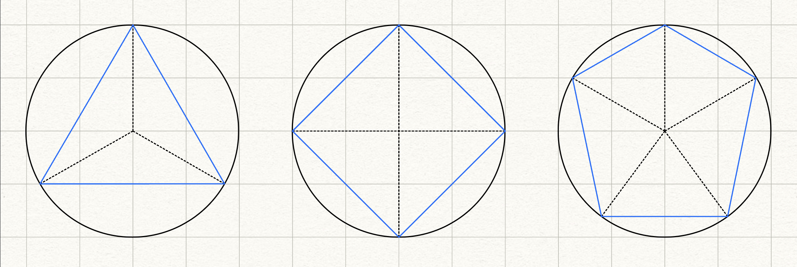
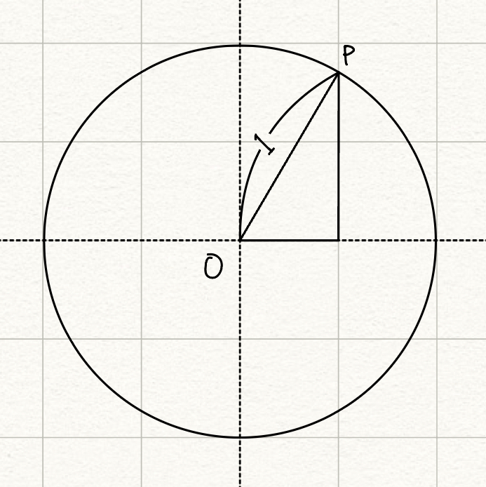

# 설명
`Line Renderer` 컴포넌트는 3D 공간에서 두 개 이상의 <u>지점 배열</u>을 가져와 **각각의 점 사이에 직선을 그리는 컴포넌트**입니다. 라인 렌더러를 사용하여 간단한 직선에서부터 파형, 다각형 등의 복잡한 나선에 이르기까지 모든 것을 그릴 수 있습니다. 다만 그려지는 모든 라인은 **연속적**이어야 합니다. 두 개 이상의 완전히 분리된 선을 그려야하는 경우 라인 렌더러를 포함한 <u>여러 개의 게임 오브젝트</u>를 사용해야 합니다.

라인 렌더러는 픽셀 단위 너비의 라인같은 가는 선은 렌더링하지 않고 월드 공간 단위 너비의 폴리곤을 렌더링합니다. 또한 트레일 렌더러와 동일한 알고리즘을 라인 렌더링에 사용합니다.

## 라인 설정

## 라인 그리기


LineRenderer 컴포넌트는 Position 프로퍼티의 위치를 기반으로 인덱스 순서대로 라인을 연결합니다. `positionCount` 메소드로 Position의 개수를 설정한 후, `SetPosition` 메소드로 Position의 위치를 설정하면 됩니다.

```cs
using UnityEngine;

[RequreComponent(typeof(LineRenderer))]
public class LineGenerator : Monobehaviour
{
    private LineRenderer _lineRenderer;

    private void Awake()
    {
        _lineRenderer = GetComponent<LineRenderer>();
    }

    public void StopDraw()
    {
        _lineRenderer.enable = false;
    }

    /// <summary>
    /// start와 end를 잇는 라인을 그리는 메소드
    /// </summary>
    /// <param name="start">시작점</param>
    /// <param name="end">끝점</param>
    public DrawLine(Vector3 start, Vector3 end)
    {
        if (_lineRenderer.enabled == false)
                _lineRenderer.enabled = true;
        _lineRenderer.positionCount = 2;
        _lineRenderer.loop = false;

        _lineRenderer.SetPosition(0, start);
        _lineRenderer.SetPosition(1, end);
    }

    /// <summary>
    /// Positions의 정보로 라인을 그리는 메소드
    /// </summary>
    /// <param name="positions"></param>
    public void DrawLine(Vector3[] positions)
    {
        if (_lineRenderer.enabled == false)
            _lineRenderer.enabled = true;
        _lineRenderer.positionCount = positions.Length;
        _lineRenderer.loop = false;

        for(int i = 0; i < positions.Length; i++)
        {
            _lineRenderer.SetPosition(i, positions[i]);
        }
    }
}
```

## 정다각형 그리기


### 다각형 꼭지점


다각형의 특징은 원에 내접하며 각각의 내접한 꼭지점과 원점의 거리가 모두 같은 특징을 지닙니다. 이를 이용해 정다각형을 그릴 수 있고 크게 2가지 방법이 있습니다.

1. Vector3 X Rotation을 이용한 좌표 계산
2. 삼각 함수를 이용한 좌표 계산

첫 번재 방법은 정말 간단합니다. 초기값 $P_0$(0, 반지름)을 구한 다음, `Quaternion.AngleAxis` 메소드를 곱하면 $\theta$만큼 회전된 위치 값이 나옵니다.
> **주의점**
> 'Vector3 X Rotation'이라 제목을 붙였지만 계산 순서는 **Rotation X Vector3** 순입니다. 역순으로 계산할 경우 에러가 발생합니다.

두 번째 방법은 약간의 수학 지식이 필요합니다. 

반지름이 1일 때, $Sin(\theta)$, $Cos(\theta)$의 점 $P$의 좌표 값이 구해집니다. 즉, $x = Cos(\theta) * R$, $y = Sin(\theta) * R$ 이라는 것을 알 수 있습니다. 유니티에서는 `Mathf` 구조체에 게임 및 앱 개발에 일반적으로 필요한 삼각 함수, 로그 함수, 기타 함수를 필요한 일반적인 함수 컬렉션을 제공하기 때문에 이를 이용하면 쉽게 구현할 수 있습니다.

> **주의점**
> `Mathf`에서 제공하는 삼각 함수의 매개 변수는 라디안을 기준으로 작동합니다. `angle * Mathf.Deg2Rad`를 계산하면 각도가 라디안으로 변환됩니다(반대로 라디안 -> 각도로 변환할 땐, `Mathf.Rad2Deg`를 곱하면 됩니다).

```cs
public class PolygonPositionsGenerator
{
    /// <summary>
    /// Vector3 x Rotation 기반 Position 계산하는 메소드
    /// </summary>
    /// <param name="numberOfPolygonPoint">다각형 꼭지점 개수</param>
    /// <param name="radius">반지름</param>
    /// <returns>다각형 꼭지점 위치</returns>
    public static Vector3[] GetPolygonPoisitionsVectorMulRotation(int numberOfPolygonPoint, float radius)
    {
        List<Vector3> positions = new List<Vector3>();
        float angle = 360f / numberOfPolygonPoint;

        positions.Add(new Vector3(0, 0, radius));
        for(int i = 1; i < numberOfPolygonPoint; i++)
        {
            positions.Add(Quaternion.AngleAxis(angle, Vector3.up) * positions[i - 1]);
        }

        return positions.ToArray();
    }

    /// <summary>
    /// 삼각 함수 기반 Position 계산하는 메소드
    /// </summary>
    /// <param name="numberOfPolygonPoint">다각형 꼭지점 개수</param>
    /// <param name="radius">반지름 </param>
    /// <returns>다각형 꼭지점 위치</returns>
    public static Vector3[] GetPolygonPositionsAngleFunction(int numberOfPolygonPoint, float radius)
    {
        List<Vector3> positions = new List<Vector3>();
        float angle = 360f / numberOfPolygonPoint;
        float currentAngle = 0f;

        for (int i = 0; i < numberOfPolygonPoint; i++)
        {
            float radian = Mathf.Deg2Rad * currentAngle;

            float x = Mathf.Cos(radian) * radius;
            float z = Mathf.Sin(radian) * radius;
            currentAngle += angle;

            positions.Add(new Vector3(x, 0, z));
        }

        return positions.ToArray();
    }
}
```

# 참고 자료
[Unity Documentation](https://docs.unity3d.com/kr/2021.2/Manual/class-LineRenderer.html)
[고박사](https://www.youtube.com/watch?v=wAY9exBIw3A)